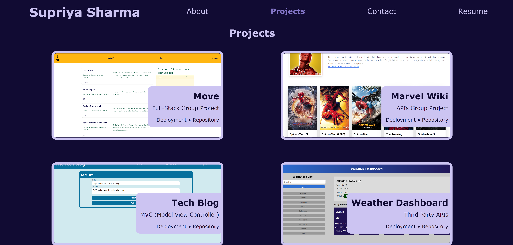
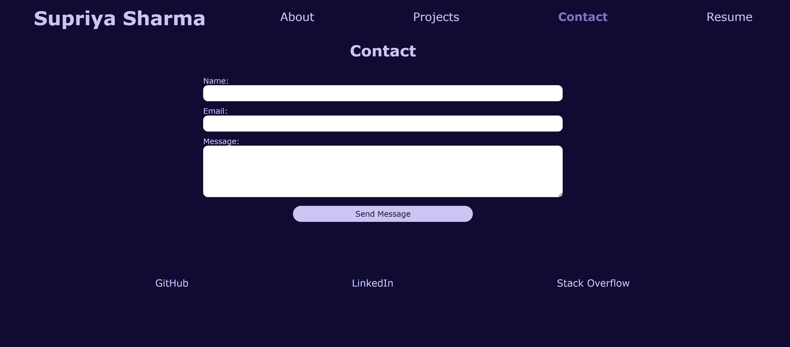

# react-portfolio

## Description

**Goal**: To create a an interactive and dynamic web page in React to showcase my work and share background to potential employers.

As web developers, we must put our projects on display to peers and managers to display our skills and gain recognition. A portfolio accomplishes that, and allows us to be part of a larger community. Including more recent technologies also gives viewers a good idea of what our skill levels are.

## Tech Stack
- JavaScript
- JSON
- Node.js
- React.js
- JSX
- npm
    - react
    - react-dom
    - react-scripts

## Deployment

[Link to deployed web page](https://supsha878.github.io/react-portfolio/)